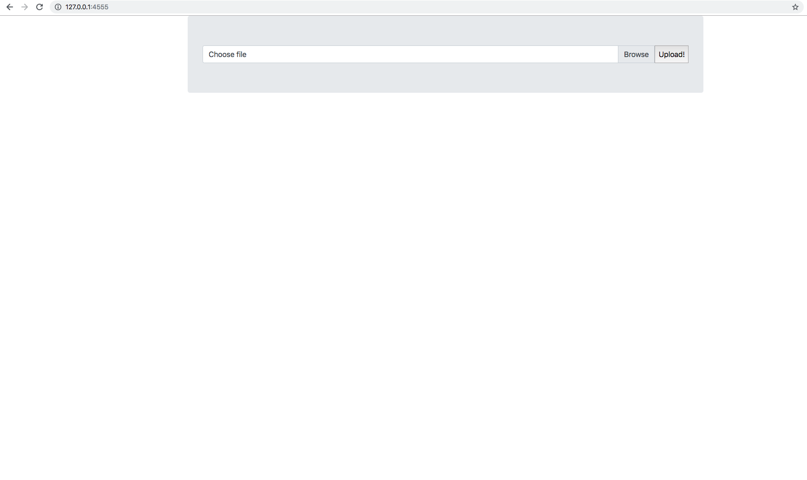
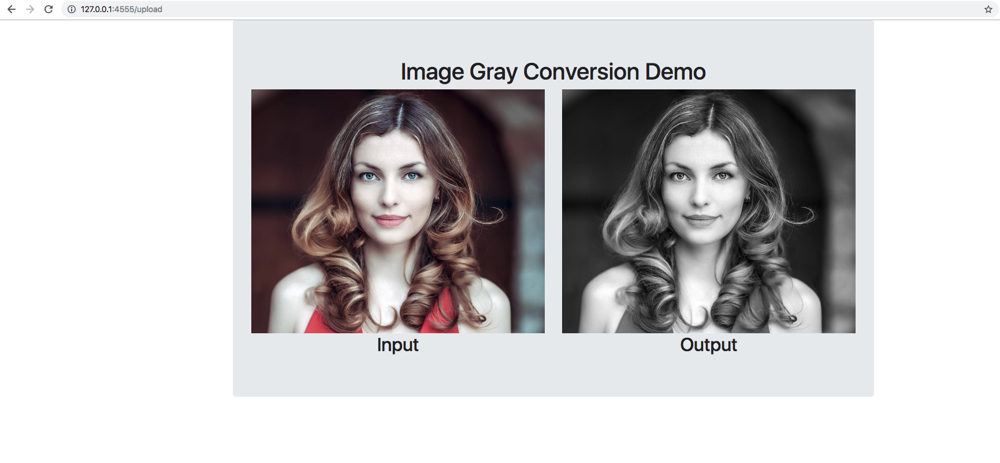

# Build Status

# flask-bgr2gray

This is a sample flask application that uses Bootstrap for the Frontend UI and PIL for image processing

## Dependencies
Flask
bootstrap
Pillow
gunicorn

## How to Use

1. `python app.py`

2. Go to 127.0.0.1:4555 on your browser.

## Output

You should get a screen shown below.

Choose Browse and upload an image. Click Upload to get the output

